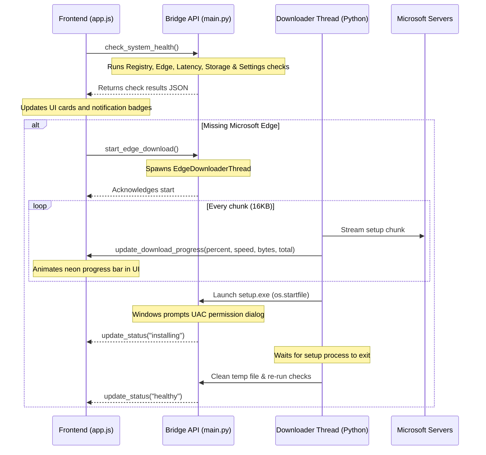

# System Health Check & Auto-Downloader Design Spec

**Date:** 2026-05-27  
**Topic:** System Health Check & Auto-Downloader  
**Goal:** Ingest a premium live diagnostic panel directly into the Tawreed desktop app that checks all system dependencies and settings, offers UAC-approved automatic downloads with real-time progress for missing tools, and validates configurations to ensure a robust "first-launch to extraction" setup.

---

## 1. System Architecture

The health check system is split into an asynchronous Python diagnostic engine (backend) and a tab-based HTML5 dashboard (frontend), communicating via `pywebview` bridge APIs.



---

## 2. Frontend Components

### 2.1 Tab Navigation
* In [gui/index.html](file:///C:/Users/karee/Desktop/QS%20Mind/tawreed/gui/index.html), we will add a new tab button under the Sidebar navigation list:
  ```html
  <button class="nav-item" data-panel="health-panel" id="nav-health">
      <span class="nav-icon">⚡</span>
      <span class="nav-text">System Health</span>
      <span class="status-badge" id="health-badge"></span>
  </button>
  ```

### 2.2 Status Dashboard Layout
We will append a new panel `#health-panel` inside the `#content-area`:
* **Overview Banner**: Shows overall system readiness index (e.g. *🟢 System Ready*, *🟡 Settings Incomplete*, *🔴 Critical Actions Required*).
* **Grid Layout**: Displays diagnostic cards:
  1. **WebView2 Runtime**: Shows version and status.
  2. **Microsoft Edge (PDF Renderer)**: Shows version, executable path, or a warning card with a `Fix Automatically` button if missing.
  3. **Internet & API Gateway Connection**: Shows live ping latency or "Offline".
  4. **Workspace Permissions**: Shows read/write access status for directories.
  5. **Credentials Configuration**: Details provider setup status.

### 2.3 Download Progress Component
When a download is in progress, the Edge card swaps to show:
* A container showing download speed (e.g. `1.2 MB/s`), percentage, and downloaded size.
* A progress bar with a neon linear gradient transition:
  ```css
  .download-progress-bar {
      height: 6px;
      border-radius: 3px;
      background: rgba(255, 255, 255, 0.08);
      overflow: hidden;
  }
  .download-progress-fill {
      height: 100%;
      width: 0%;
      background: linear-gradient(90deg, var(--brand-primary) 0%, var(--brand-secondary) 100%);
      transition: width 0.15s ease-out;
  }
  ```

---

## 3. Backend Bridge APIs & Logic

We will introduce two core methods inside the `TawreedAPI` class in [main.py](file:///C:/Users/karee/Desktop/QS%20Mind/tawreed/main.py):

### 3.1 `check_system_health(self) -> dict`
Runs diagnostics and returns a dictionary payload:
* **Edge Check**: Scans registry paths `SOFTWARE\Microsoft\Windows\CurrentVersion\App Paths\msedge.exe` and typical directories (`C:\Program Files\Microsoft\Edge\Application\msedge.exe`).
* **WebView2 Check**: Queries registry `SOFTWARE\Microsoft\EdgeUpdate\Clients\{F3017226-FE2A-4295-8BDF-00C3A9A7E4C5}\pv` to get version.
* **Latency Check**: Sends a fast ping-like HEAD request to `https://www.google.com` (timeout 2.0s) and measures response time.
* **Storage Check**: Verifies read/write access in config paths.
* **Settings Check**: Validates schema completeness of the config.

### 3.2 `start_edge_download(self) -> bool`
Checks if a download is already active; if not, spawns the `EdgeDownloaderThread` daemon in Python.

---

## 4. Multi-Threaded Downloader Engine

A background daemon thread `EdgeDownloaderThread` will be implemented:
1. **Streaming Download**: Downloads the standalone bootstrapper (`https://go.microsoft.com/fwlink/?linkid=2108834`) using `requests.get(url, stream=True)` with a timeout of 10s.
2. **Chunk Callback**:
   * Reads data in 16KB blocks.
   * Tracks total bytes downloaded and computes elapsed time.
   * Calculates instantaneous download speed in KB/s and progress percentage.
   * Calls frontend JavaScript bridge method `window.pywebview.api.update_download_progress(percent, speed_kb, bytes, total)` on the main UI thread.
3. **UAC Execution**:
   * Saves the installer to `%TEMP%/MicrosoftEdgeSetup.exe`.
   * Executes the installer using `os.startfile(temp_installer_path)`.
   * Monitors the installer process using `psutil` or `subprocess.Popen` polling.
   * Cleans up the temporary setup file after completion.

---

## 5. Verification Plan

### 5.1 Automated Tests
* **Simulated Edge Missing**: Temporarily modify Edge paths in the Python code to point to invalid directories and check if the dashboard correctly flags Microsoft Edge as "Missing".
* **Connection Latency Checks**: Run tests under simulated high latency or offline states to verify correct UI badge transition.

### 5.2 Manual Verification
1. Launch `tawreed.exe` and navigate to the new **System Health** tab.
2. Confirm WebView2 version, network ping, and storage permissions are evaluated live.
3. Run the connection checks for Gemini/OpenAI setting setups.
4. Verify progress percentages render accurately during simulated downloads.
